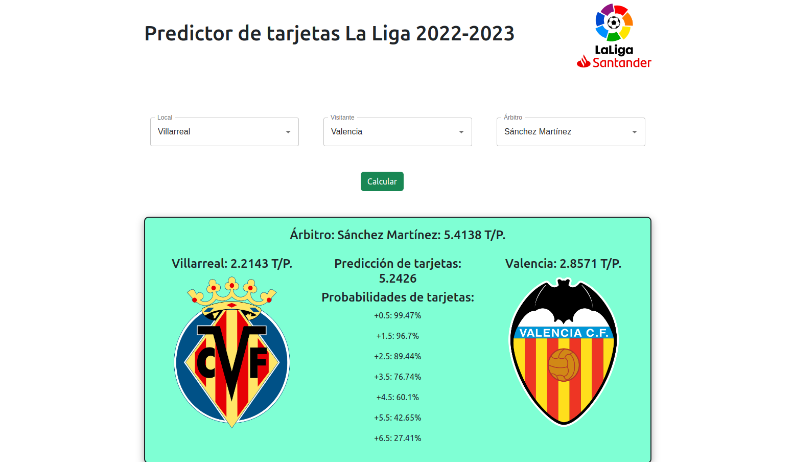

Hi! In this entry I want to share a little project I have developed in order to research on probabilities in the world of football, specifically on the probabilities of cards in matches.

The data is obtained with a simple excel file where, with the help of the importhtml function. The data of both the teams in the current season and the referees of the league in the last two seasons is obtained from <a href = "https://www.marca.com/futbol/primera-division/estadisticas-equipos.html"> and <a href = "https://www.futbolfantasy.com/laliga/arbitros/2023"> respectively. Then, the excel files are downloaded in .csv format for better handling.

For the backend side I decieded to use R language because of it's simplicity to read .csv files, compute models and compute calculations. The model chosen to predict the cards is a Poisson model where the lambda parameter is built with the average of the cards per game of the referee and the cards per game of the teams that play the match (weighted by 2 because both teams contribute equally to the total cards of the match). The backend info is available for the frontend as I created an API with the help of the plumber function of R, which makes it possible to perform GET or POST requests to the computations that we do.

For the frontend side I used the common web technologies (javascript, css and html) with the help of the Bootstrap framework and with the inclusion of the React framework, wich I recently learned to use and in whose management and posibilities I want to improve. From this side, we can choose the teams and the referee of the match and we can see the number of cards as a prediction and the probabilities of having a certain number of cards in the game.

Here is an image of a use case:
